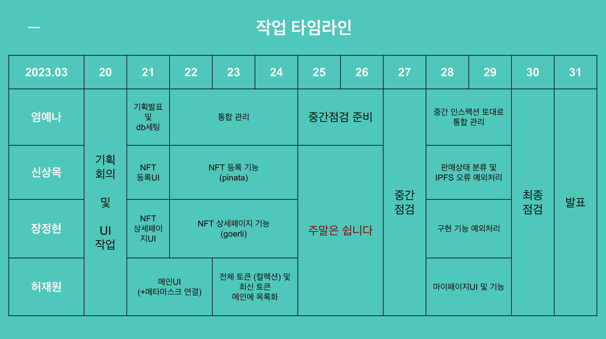
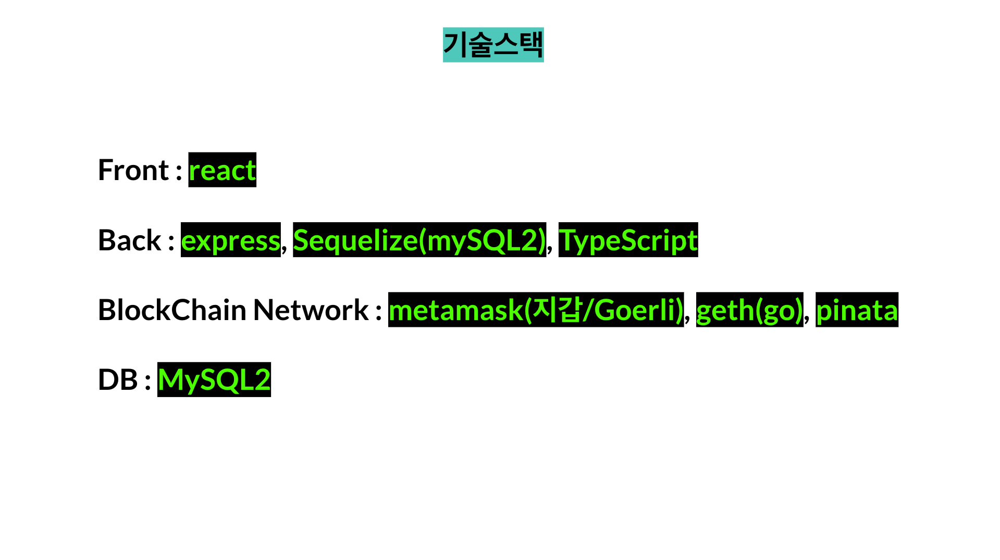

# MintchoNFT

# 민초단의 민초 NFT market 프로젝트

# 프로젝트 소개

## 프로젝트 개요

#### - 누구나 쉽고, 즐겁게, 안전하게 NFT를 사고 팔 수 있는 홈페이지 제작

## 프로젝트 목적

#### - React, Node.js(express), DB 활용 및 Metamask & Geth & Pinata 등을 결합한 BlockChain 거래소 코딩으로 이전에 학습한 내용 복습

## 프로젝트 내용

#### - 메인 페이지 (”/”) : NFT 목록 (전체+최신), 로그인을 원하는 경우 헤더의 지갑 버튼을 눌러 메타마스크를 연결하게 해주는 페이지

#### - NFT 상세정보 페이지 (”/detail”) : 토큰의 거래내역 및 상세정보를 확인할 수 있는 페이지

#### - 민팅 페이지 (”/minting”) : 판매를 원하는 크리에이터가 NFT를 등록할 수 있도록 하는 페이지

#### - 마이 페이지 (”/mypage”) : 본인이 등록한 NFT와 보유한 NFT를 확인할 수 있는 페이지

## 예상 타임라인

## 기술 스택

## 구현

#### 사진사진

## 이슈

### - 어쩌구

### ㄴsolution : 어쩌구

---

# 팀 소개

### 팀장 : 염예나

### 팀원 : 신상목, 장정현, 허재원

#

## 라이센스

---

MIT MINTCHODAN
